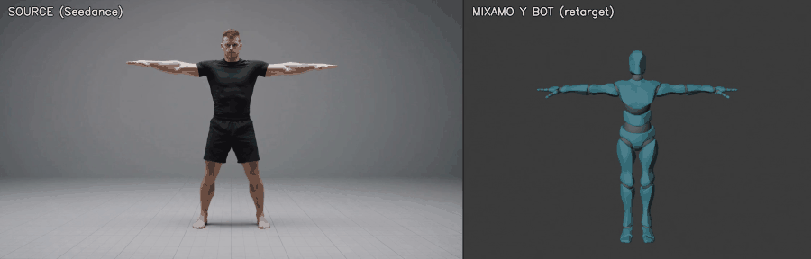

# Mixamo LLM Mocap

**Turn any locked-camera video — filmed or AI-generated — into a clean
FK animation on any Mixamo character. No mocap suit, no manual
keyframing, and every stage scriptable enough that an AI agent can run
the whole loop.**




*Left: AI-generated source video. Right: the automatic retarget on a
Mixamo character in Blender — 10 seconds, nine punches, a slip under
and a high side kick, straight through the pipeline.*

## How it works

```
video plate (locked camera, T-pose bookends)
   │
   ├─ 1. estimate_pose_gvhmr.py    GVHMR (SMPL-X mesh recovery) → 33 landmarks + pelvis height
   ├─ 2. analyze_landmarks.py     numeric beat detection → you write a beat sheet from NUMBERS
   ├─ 3. action_specs/<name>.json  the motion as data: support schedule, rest blends, fists
   ├─ 4. lift_to_mixamo.py         direction-preserving retarget onto YOUR rig's proportions
   ├─ 5. apply_mixamo_fk.py        FK aim + foot planting, inside live Blender (via Blender MCP)
   └─ 6. qa_clip.py                automated gate: no explosions, no pops, no foot skate
```

The estimator provides mesh-quality joints; the lift keeps its segment
*directions* but rebuilds every position from your character's measured
bone lengths; the apply plants feet by solving hip height (never IK —
Mixamo rigs are FK-only); the spec contributes only what a video cannot
know: which foot is the support in each phase (including `"none"` for
airborne beats), when fists close, where the clip locks back to rest.

## Why it's different

- **Any Mixamo character.** `setup_rig.py` builds a clean scene from
  your own Mixamo download and measures it into `rig_profile.json`
  (rest pose, bone lengths, hip and ground heights). Every stage reads
  that profile.
- **Motions are data, not code.** A new motion is a small JSON spec —
  the three `action_specs/` here (a kung-fu form, a combo with a jump,
  a fight combination) are worked examples of the whole schema.
- **Honest Mixamo FK.** Hips are the only translating bone, everything
  else is quaternions at 30 fps — clips drop into any Mixamo-style
  workflow without cleanup.
- **Real ground contact.** Planted feet solve to ground height with
  zero skate (the support ankle is pinned through each stance); jumps
  integrate the estimator's real pelvis arc.
- **A QA gate, not vibes.** Exploded bones, hip pops, foot skate,
  drifting roots and broken rest poses are caught numerically before a
  human ever looks.
- **Written for agents.** Beat decisions come from
  `analyze_landmarks.py` numbers (never from eyeballing frames), every
  stage is a CLI or a socket call, and `docs/PITFALLS.md` encodes every
  mistake so the next operator — human or AI — doesn't repeat them.

## Quickstart

1. **Install** — [docs/INSTALL.md](docs/INSTALL.md) walks through every
   dependency (list below).
2. **Build your rig scene**:

   ```
   blender --background --python pipeline\setup_rig.py -- --fbx ybot.fbx --out ybot_rest.blend
   ```

3. **Run a plate** (Blender open on the scene; plate rules in
   [docs/PROMPTING.md](docs/PROMPTING.md)):

   ```
   tools\GVHMR\.venv\Scripts\python.exe pipeline\estimate_pose_gvhmr.py --video plates\<name>\<name>.mp4 --out plates\<name>\landmarks.json
   tools\GVHMR\.venv\Scripts\python.exe pipeline\analyze_landmarks.py --landmarks plates\<name>\landmarks.json
   # beat sheet → action_specs\<name>.json  (schema: docs/PIPELINE.md)
   tools\GVHMR\.venv\Scripts\python.exe pipeline\lift_to_mixamo.py --spec action_specs\<name>.json
   # in Blender:  import apply_mixamo_fk; apply_mixamo_fk.run("action_specs/<name>.json")
   tools\GVHMR\.venv\Scripts\python.exe pipeline\qa_clip.py --spec action_specs\<name>.json
   ```

4. **Iterate** with [docs/PIPELINE.md](docs/PIPELINE.md) and
   [docs/PITFALLS.md](docs/PITFALLS.md).

## What you need to bring (and where to get it)

| What | Where | Notes |
|---|---|---|
| **A Mixamo character — any model** | [mixamo.com](https://www.mixamo.com) → Characters → download FBX Binary, T-pose | Adobe's terms don't allow redistributing them; `setup_rig.py` builds and validates the scene from your download |
| **Blender 5.1+** | [blender.org](https://www.blender.org/download/) | |
| **Blender MCP add-on** (official, Blender Lab) | [blender.org/lab/mcp-server](https://www.blender.org/lab/mcp-server/) | enable *Allow Online Access*; the apply talks to its socket |
| **GVHMR** (the pose estimator — **not in this repo**) | [github.com/zju3dv/GVHMR](https://github.com/zju3dv/GVHMR) | clone into `tools/GVHMR`; install per [docs/INSTALL.md](docs/INSTALL.md) — including a working Windows recipe (`docs/requirements_gvhmr_windows.txt` + prebuilt pytorch3d wheel) |
| **GVHMR checkpoints** (~5 GB) | HuggingFace mirror | exact `curl` commands in [docs/INSTALL.md](docs/INSTALL.md) |
| **SMPL-X body model** | [smpl-x.is.tue.mpg.de](https://smpl-x.is.tue.mpg.de/) | free research registration → download *SMPL-X v1.1*, place `SMPLX_NEUTRAL.npz` as shown in [docs/INSTALL.md](docs/INSTALL.md) |
| **NVIDIA GPU** | ~8 GB VRAM | developed on an RTX 4080 |

## Docs

| Doc | What it covers |
|---|---|
| [docs/INSTALL.md](docs/INSTALL.md) | Every dependency, step by step, Windows-proven |
| [docs/PIPELINE.md](docs/PIPELINE.md) | The operational loop + the action_spec schema, field by field |
| [docs/RIG.md](docs/RIG.md) | Mixamo rig conventions: spaces, units, the rules that must never break |
| [docs/PITFALLS.md](docs/PITFALLS.md) | Every mistake this pipeline's development paid for, so you don't pay twice |
| [docs/PROMPTING.md](docs/PROMPTING.md) | Writing gen-video plate prompts that survive retargeting |

## License

MIT — see [LICENSE](LICENSE), including third-party notes (Mixamo,
GVHMR, SMPL-X, Blender MCP).
